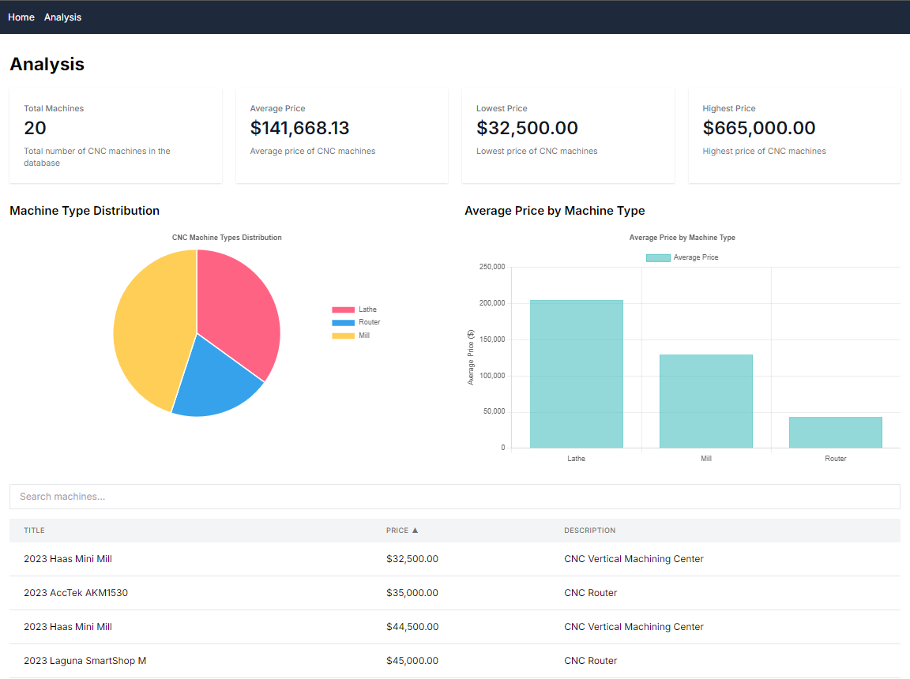

# CNC Machine Scraper and Analysis Tool

## Overview

This project is a web application that scrapes CNC machine data from various sources, stores it in a database, and provides analysis and visualization tools for the collected data. It's built using Next.js, React, and MongoDB.

## Features

- Web scraping of CNC machine listings
- Data storage in MongoDB
- Data analysis and visualization, including:
  - Total machine count
  - Average, minimum, and maximum prices
  - Machine type distribution (pie chart)
  - Average price by machine type (bar chart)
- Interactive table for viewing and sorting machine data
- Search functionality for machine listings

## Technology Stack

- Frontend: React, Next.js
- Backend: Node.js, Next.js API routes
- Database: MongoDB
- Data Visualization: Chart.js
- Styling: Tailwind CSS

## Scraper Technology

The web scraper is built using the following technologies:

- Axios: For making HTTP requests to target websites
- Cheerio: For parsing and manipulating the HTML of scraped pages
- Server-Sent Events (SSE): For real-time progress updates during scraping
- Custom headers: Including cookies and user agents to mimic browser behavior

The scraper is designed to handle multiple pages and can be configured for different target websites. It includes error handling and progress reporting features.

## Setup

1. Clone the repository
2. Install dependencies: `npm install`
3. Set up environment variables (see `.env.example`)
4. Run the development server: `npm run dev`

## Usage

- Visit the home page to initiate a new scraping job
- Navigate to the Analysis page to view insights on the collected data
- Use the interactive table to search and sort through machine listings

## API Endpoints

- `/api/scrape`: Initiates a web scraping job
- `/api/machines`: Retrieves all stored machine data
- `/api/health`: Health check endpoint

## Project Screenshot

*Data Analysis Page*
